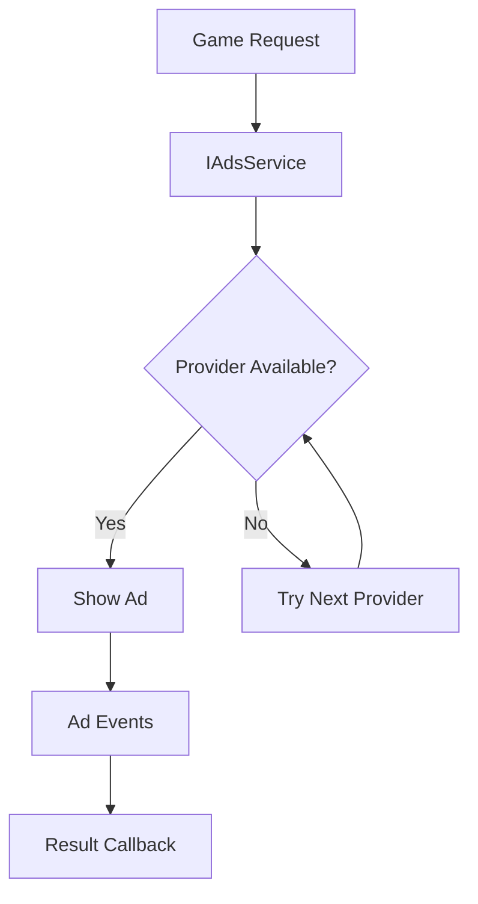

# UniGame LevelPlay Ads Module

Comprehensive advertising system for Unity games with support for multiple ad providers and flexible placement management.

- [UniGame LevelPlay Ads Module](#unigame-levelplay-ads-module)
  - [Overview](#overview)
  - [Installation](#installation)
    - [Dependencies](#dependencies)
  - [Core Architecture](#core-architecture)
    - [System Components](#system-components)
    - [Ads Flow](#ads-flow)
  - [Quick Start](#quick-start)
    - [Basic Setup](#basic-setup)
    - [Configuration](#configuration)
  - [Ads Service Interface](#ads-service-interface)
    - [Core Methods](#core-methods)
    - [Event System](#event-system)
  - [Supported Providers](#supported-providers)
    - [LevelPlay (IronSource)](#levelplay-ironsource)
    - [AdMob](#admob)
    - [Yandex Mobile Ads](#yandex-mobile-ads)
    - [Debug Provider](#debug-provider)
    - [Composite Provider](#composite-provider)
  - [Placement Management](#placement-management)
    - [Placement Configuration](#placement-configuration)
    - [Platform-Specific Placements](#platform-specific-placements)
    - [Placement Types](#placement-types)
  - [Usage Examples](#usage-examples)
    - [Basic Ad Display](#basic-ad-display)
    - [Rewarded Video](#rewarded-video)
    - [Interstitial Ads](#interstitial-ads)
    - [Event Handling](#event-handling)
  - [Advanced Features](#advanced-features)
    - [Composite Ads Service](#composite-ads-service)
    - [Custom Providers](#custom-providers)
    - [Placement Validation](#placement-validation)
    - [Error Handling](#error-handling)
  - [Configuration Guide](#configuration-guide)
    - [LevelPlay Configuration](#levelplay-configuration)
    - [AdMob Configuration](#admob-configuration)
    - [Yandex Configuration](#yandex-configuration)
  - [Best Practices](#best-practices)
    - [Performance Optimization](#performance-optimization)
    - [User Experience](#user-experience)
    - [Testing](#testing)
  - [Troubleshooting](#troubleshooting)
    - [Common Issues](#common-issues)
    - [Debug Tips](#debug-tips)
  - [API Reference](#api-reference)
    - [IAdsService](#iadsservice)
    - [AdsProvider](#adsprovider)
    - [AdsShowResult](#adsshowresult)
    - [AdsActionData](#adsactiondata)

## Overview

UniGame LevelPlay Ads Module provides a unified advertising system for Unity games with support for multiple ad networks. The module features:

- **Multi-Provider Support**: LevelPlay (IronSource), AdMob, Yandex Mobile Ads, and custom providers
- **Unified API**: Single interface for all ad operations across different networks
- **Placement Management**: Flexible placement configuration with platform-specific settings
- **Event System**: Comprehensive event tracking for ad lifecycle management
- **Async/Await Support**: Modern async programming patterns with UniTask
- **Composite Service**: Automatic failover between multiple ad providers
- **Debug Tools**: Built-in debugging and testing capabilities

## Installation

Add the package to your Unity project using the Package Manager:

### Dependencies

```json
{
  "dependencies": {
    "com.unity.services.levelplay": "8.1.0",
    "com.unity.addressables": "2.6.0",
    "com.unigame.unicore": "https://github.com/UnioGame/unigame.core.git",
    "com.cysharp.unitask": "https://github.com/Cysharp/UniTask.git?path=src/UniTask/Assets/Plugins/UniTask",
    "com.cysharp.r3": "https://github.com/Cysharp/R3.git?path=src/R3.Unity/Assets/R3.Unity"
  }
}
```

## Core Architecture

### System Components

- **IAdsService**: Core interface for all ad operations
- **AdsProvider**: Abstract base class for ad network providers
- **GameAdsServiceSource**: Service factory for creating ad services
- **AdsConfiguration**: Configuration container for ad settings
- **PlacementIdDataAsset**: Placement management system

### Ads Flow



## Quick Start

### Basic Setup

1. **Create Ads Service Source**:

```csharp
[CreateAssetMenu(menuName = "Game/Services/Ads/Ads Source")]
public class GameAdsServiceSource : DataSourceAsset<IAdsService>
{
    public AdsConfiguration adsConfiguration = new AdsConfiguration();
    
    protected override async UniTask<IAdsService> CreateInternalAsync(IContext context)
    {
        var provider = adsConfiguration.providers
            .FirstOrDefault(x => x.providerName.Equals(adsConfiguration.adsProvider));
        
        return await provider.Create(context);
    }
}
```

2. **Configure Ads Service**:

```csharp
// In your game initialization
var adsService = await context.Get<IAdsService>();

// Check availability
if (adsService.RewardedAvailable)
{
    var result = await adsService.ShowRewardedAdAsync("reward_placement");
    if (result.Rewarded && !result.Error)
    {
        // Grant reward to player
        Debug.Log($"Reward granted: {result.RewardName}");
    }
}
```

### Configuration

Create an `AdsConfiguration` asset and configure your providers:

```csharp
[Serializable]
public class AdsConfiguration
{
    public string adsProvider = "levelplay"; // Active provider
    public AdsProvider[] providers = new AdsProvider[]
    {
        new LevelPlayAdsProvider(),
        new AdMobAdsProvider(),
        new DebugAdsProvider()
    };
}
```

## Ads Service Interface

### Core Methods

```csharp
public interface IAdsService : IGameService, IDisposable
{
    // Availability checks
    bool RewardedAvailable { get; }
    bool InterstitialAvailable { get; }
    
    // Event stream
    Observable<AdsActionData> AdsAction { get; }
    
    // Core operations
    UniTask<bool> IsPlacementAvailable(string placementName);
    UniTask LoadAdsAsync();
    UniTask<AdsShowResult> Show(string placement, PlacementType type);
    UniTask<AdsShowResult> ShowRewardedAdAsync(string placeId);
    UniTask<AdsShowResult> ShowInterstitialAdAsync(string placeId);
    
    // Validation
    void ValidateIntegration();
}
```

### Event System

Monitor ad events in real-time:

```csharp
adsService.AdsAction
    .Subscribe(actionData => 
    {
        Debug.Log($"Ad Event: {actionData.ActionType} for {actionData.PlacementName}");
        
        switch (actionData.ActionType)
        {
            case PlacementActionType.Opened:
                // Ad started showing
                break;
            case PlacementActionType.Closed:
                // Ad was closed
                break;
            case PlacementActionType.Rewarded:
                // User earned reward
                break;
            case PlacementActionType.Failed:
                // Ad failed to show
                break;
        }
    })
    .AddTo(lifeTime);
```

## Supported Providers

### LevelPlay (IronSource)

Primary ad provider with full feature support:

```csharp
[Serializable]
public class LevelPlayAdsProvider : AdsProvider
{
    public LevelPlayAdsConfig levelPlayAdsConfig = new();
    
    public override UniTask<IAdsService> Create(IContext context)
    {
        var service = new LevelPlayAdsService(levelPlayAdsConfig);
        return UniTask.FromResult<IAdsService>(service);
    }
}
```

**Configuration**:
```csharp
[Serializable]
public class LevelPlayAdsConfig
{
    public bool enableAds = true;
    public string LivePlayAppKey = "your_app_key";
    public bool validateIntegration = true;
    public bool shouldTrackNetworkState = false;
    public float reloadAdsInterval = 30f;
    public PlacementIdDataAsset placementIds;
}
```

### AdMob

Google AdMob integration:

```csharp
[Serializable]
public class AdMobAdsProvider : AdsProvider
{
    public AdmobAdsConfig adsMobConfig = new();
    
    public override UniTask<IAdsService> Create(IContext context)
    {
        var service = new AdmobAdsService(adsMobConfig);
        return UniTask.FromResult<IAdsService>(service);
    }
}
```

### Yandex Mobile Ads

Yandex advertising platform support:

```csharp
public class YandexAdsService : IAdsService
{
    private YandexAdsConfiguration _adsConfig;
    private RewardedAdLoader _rewardedAdLoader;
    private RewardedAd _rewardedAd;
    
    // Implementation details...
}
```

### Debug Provider

Testing and development provider:

```csharp
public class DebugAdsService : IAdsService
{
    public bool RewardedAvailable => true;
    public bool InterstitialAvailable => true;
    
    public async UniTask<AdsShowResult> ShowRewardedAdAsync(string placeId)
    {
        return new AdsShowResult()
        {
            Message = "Debug reward completed!",
            PlacementName = placeId,
            PlacementType = PlacementType.Rewarded,
            Rewarded = true
        };
    }
}
```

### Composite Provider

Automatic failover between multiple providers:

```csharp
public class CompositeAdsService : IAdsService
{
    private List<IAdsService> _adsServices;
    private IAdsService _serviceWithAvailableAds;
    
    public async UniTask<bool> IsPlacementAvailable(string placementName)
    {
        foreach (var service in _adsServices)
        {
            if (await service.IsPlacementAvailable(placementName))
            {
                _serviceWithAvailableAds = service;
                return true;
            }
        }
        return false;
    }
}
```

## Placement Management

### Placement Configuration

Define ad placements with platform-specific IDs:

```csharp
[Serializable]
public struct AdsPlacementItem
{
    public int Id;
    public string Name;
    public List<AdsPlacementPlatformItem> Placements;
    public PlacementType Type;
    
    public string GetPlacementIdByPlatform(PlacementPlatfrom platform)
    {
        return Placements.FirstOrDefault(x => x.Platfrom == platform)?.PlacementId;
    }
}
```

### Platform-Specific Placements

Configure different placement IDs for each platform:

```csharp
[Serializable]
public class AdsPlacementPlatformItem
{
    public PlacementPlatfrom Platfrom; // Google, iOS, Debug
    public string PlacementId;
}
```

### Placement Types

Supported ad formats:

```csharp
public enum PlacementType : byte
{
    Rewarded,      // Rewarded video ads
    Interstitial,  // Full-screen interstitial ads
    Banner,        // Banner ads (limited support)
}
```

## Usage Examples

### Basic Ad Display

```csharp
public class AdsManager : MonoBehaviour
{
    [SerializeField] private IAdsService _adsService;
    
    public async void ShowRewardedAd()
    {
        if (!_adsService.RewardedAvailable)
        {
            Debug.Log("Rewarded ad not available");
            return;
        }
        
        var result = await _adsService.ShowRewardedAdAsync("main_reward");
        
        if (result.Rewarded && !result.Error)
        {
            // Grant reward
            PlayerData.AddCoins(100);
            Debug.Log("Reward granted!");
        }
        else
        {
            Debug.LogError($"Ad failed: {result.Message}");
        }
    }
}
```

### Rewarded Video

```csharp
public async UniTask<bool> ShowRewardedVideo(string placement)
{
    // Check availability
    if (!await _adsService.IsPlacementAvailable(placement))
    {
        ShowMessage("Ad not available");
        return false;
    }
    
    // Show ad
    var result = await _adsService.Show(placement, PlacementType.Rewarded);
    
    if (result.Rewarded)
    {
        // Process reward
        var rewardAmount = result.RewardAmount;
        var rewardType = result.RewardName;
        
        GrantReward(rewardType, rewardAmount);
        return true;
    }
    
    return false;
}
```

### Interstitial Ads

```csharp
public async void ShowInterstitialAd()
{
    if (_adsService.InterstitialAvailable)
    {
        var result = await _adsService.ShowInterstitialAdAsync("level_complete");
        
        if (result.Error)
        {
            Debug.LogError($"Interstitial failed: {result.Message}");
        }
    }
}
```

### Event Handling

```csharp
private void SubscribeToAdEvents()
{
    _adsService.AdsAction
        .Where(x => x.PlacementType == PlacementType.Rewarded)
        .Subscribe(HandleRewardedAdEvent)
        .AddTo(lifeTime);
}

private void HandleRewardedAdEvent(AdsActionData actionData)
{
    switch (actionData.ActionType)
    {
        case PlacementActionType.Opened:
            PauseGame();
            break;
            
        case PlacementActionType.Closed:
            ResumeGame();
            break;
            
        case PlacementActionType.Rewarded:
            ProcessReward(actionData.PlacementName);
            break;
            
        case PlacementActionType.Failed:
            HandleAdError(actionData.Message, actionData.ErrorCode);
            break;
    }
}
```

## Advanced Features

### Composite Ads Service

Use multiple providers with automatic failover:

```csharp
public class CompositeAdsConfiguration : ScriptableObject
{
    public List<AdsProviderItem> adsProviders = new();
}

// Usage
var compositeService = new CompositeAdsService(new List<IAdsService>
{
    levelPlayService,
    admobService,
    debugService
});
```

### Custom Providers

Create custom ad providers:

```csharp
[Serializable]
public class CustomAdsProvider : AdsProvider
{
    public override async UniTask<IAdsService> Create(IContext context)
    {
        var service = new CustomAdsService();
        await service.InitializeAsync();
        return service;
    }
}

public class CustomAdsService : IAdsService
{
    public bool RewardedAvailable { get; private set; }
    public bool InterstitialAvailable { get; private set; }
    public Observable<AdsActionData> AdsAction => _adsAction;
    
    private Subject<AdsActionData> _adsAction = new();
    
    // Implement interface methods...
}
```

### Placement Validation

Validate placements before showing ads:

```csharp
public async UniTask<bool> ValidatePlacement(string placementName)
{
    // Check if placement exists
    if (!_placements.ContainsKey(placementName))
    {
        Debug.LogError($"Placement '{placementName}' not found");
        return false;
    }
    
    // Check if placement is available
    var available = await _adsService.IsPlacementAvailable(placementName);
    if (!available)
    {
        Debug.LogWarning($"Placement '{placementName}' not available");
        return false;
    }
    
    return true;
}
```

### Error Handling

Implement comprehensive error handling:

```csharp
public async UniTask<AdsShowResult> ShowAdWithRetry(string placement, int maxRetries = 3)
{
    for (int i = 0; i < maxRetries; i++)
    {
        try
        {
            var result = await _adsService.ShowRewardedAdAsync(placement);
            
            if (!result.Error)
                return result;
                
            Debug.LogWarning($"Ad attempt {i + 1} failed: {result.Message}");
            
            // Wait before retry
            await UniTask.Delay(TimeSpan.FromSeconds(2));
        }
        catch (Exception ex)
        {
            Debug.LogError($"Ad error on attempt {i + 1}: {ex.Message}");
        }
    }
    
    return new AdsShowResult { Error = true, Message = "Max retries exceeded" };
}
```

## Configuration Guide

### LevelPlay Configuration

```csharp
[CreateAssetMenu(menuName = "Ads/LevelPlay/Config")]
public class LevelPlayAdsConfig : ScriptableObject
{
    [Header("General Settings")]
    public bool enableAds = true;
    public string LivePlayAppKey = "your_app_key";
    
    [Header("Debug Settings")]
    public bool validateIntegration = true;
    public bool shouldTrackNetworkState = false;
    
    [Header("Performance")]
    public float reloadAdsInterval = 30f;
    
    [Header("Placements")]
    public PlacementIdDataAsset placementIds;
}
```

### AdMob Configuration

```csharp
[CreateAssetMenu(menuName = "Ads/AdMob/Config")]
public class AdmobAdsConfig : AdsConfig
{
    [Header("AdMob Settings")]
    public string androidAppId = "ca-app-pub-xxx~xxx";
    public string iosAppId = "ca-app-pub-xxx~xxx";
    
    [Header("Test Settings")]
    public bool useTestAds = false;
    public string[] testDeviceIds = new string[0];
}
```

### Yandex Configuration

```csharp
[CreateAssetMenu(menuName = "Ads/Yandex/Config")]
public class YandexAdsConfiguration : AdsConfig
{
    public AdsPlacementItem GetRewardedPlacement()
    {
        return placementIds.Placements
            .FirstOrDefault(x => x.Type == PlacementType.Rewarded);
    }
}
```

## Best Practices

### Performance Optimization

1. **Preload Ads**:
```csharp
// Preload ads during loading screens
await _adsService.LoadAdsAsync();
```

2. **Check Availability**:
```csharp
// Always check before showing
if (await _adsService.IsPlacementAvailable(placement))
{
    await _adsService.ShowRewardedAdAsync(placement);
}
```

3. **Use Appropriate Intervals**:
```csharp
// Don't show ads too frequently
private float _lastAdTime;
private const float MIN_AD_INTERVAL = 60f; // 1 minute

public bool CanShowAd()
{
    return Time.time - _lastAdTime >= MIN_AD_INTERVAL;
}
```

### User Experience

1. **Provide Clear Context**:
```csharp
public void ShowRewardPrompt()
{
    var popup = ShowPopup("Watch ad to get 100 coins?");
    popup.OnConfirm += () => ShowRewardedAd("coin_reward");
}
```

2. **Handle Failures Gracefully**:
```csharp
private async void ShowAdWithFallback(string placement)
{
    var result = await _adsService.ShowRewardedAdAsync(placement);
    
    if (result.Error)
    {
        // Offer alternative reward method
        ShowAlternativeReward();
    }
}
```

### Testing

1. **Use Debug Provider**:
```csharp
#if UNITY_EDITOR || DEVELOPMENT_BUILD
    adsConfiguration.adsProvider = "debug";
#else
    adsConfiguration.adsProvider = "levelplay";
#endif
```

2. **Test All Scenarios**:
```csharp
public class AdsTester : MonoBehaviour
{
    public async void TestAllPlacements()
    {
        foreach (var placement in _placements)
        {
            Debug.Log($"Testing placement: {placement.Name}");
            var result = await _adsService.ShowRewardedAdAsync(placement.Name);
            Debug.Log($"Result: {result.Rewarded}, Error: {result.Error}");
        }
    }
}
```

## Troubleshooting

### Common Issues

**Ads Not Loading**:
- Check internet connection
- Verify placement IDs
- Ensure SDK is properly initialized
- Check for ad inventory availability

**Integration Errors**:
- Verify all dependencies are installed
- Check assembly definition references
- Ensure proper SDK configuration

**Performance Issues**:
- Reduce ad loading frequency
- Implement proper caching
- Monitor memory usage

### Debug Tips

1. **Enable Verbose Logging**:
```csharp
public class AdsDebugger : MonoBehaviour
{
    private void Start()
    {
        _adsService.AdsAction
            .Subscribe(action => Debug.Log($"[ADS] {action.ActionType}: {action.Message}"))
            .AddTo(lifeTime);
    }
}
```

2. **Validate Integration**:
```csharp
private void ValidateAdsIntegration()
{
    _adsService.ValidateIntegration();
    
    // Check each placement
    foreach (var placement in _placements)
    {
        var available = await _adsService.IsPlacementAvailable(placement.Name);
        Debug.Log($"Placement {placement.Name}: {(available ? "Available" : "Not Available")}");
    }
}
```

3. **Monitor Events**:
```csharp
private void MonitorAdEvents()
{
    _adsService.AdsAction
        .Where(x => x.ActionType == PlacementActionType.Failed)
        .Subscribe(failure => 
        {
            Debug.LogError($"Ad Failed: {failure.PlacementName} - {failure.Message} (Code: {failure.ErrorCode})");
        })
        .AddTo(lifeTime);
}
```

## API Reference

### IAdsService

Main interface for ad operations:

```csharp
public interface IAdsService : IGameService, IDisposable
{
    bool RewardedAvailable { get; }
    bool InterstitialAvailable { get; }
    Observable<AdsActionData> AdsAction { get; }
    
    void ValidateIntegration();
    UniTask<bool> IsPlacementAvailable(string placementName);
    UniTask LoadAdsAsync();
    UniTask<AdsShowResult> Show(string placement, PlacementType type);
    UniTask<AdsShowResult> Show(PlacementType type);
    UniTask<AdsShowResult> ShowRewardedAdAsync(string placeId);
    UniTask<AdsShowResult> ShowInterstitialAdAsync(string placeId);
}
```

### AdsProvider

Base class for ad network providers:

```csharp
[Serializable]
public abstract class AdsProvider
{
    public string providerName;
    public abstract UniTask<IAdsService> Create(IContext context);
}
```

### AdsShowResult

Result data from ad display operations:

```csharp
[Serializable]
public class AdsShowResult
{
    public string PlacementName = string.Empty;
    public string RewardName = string.Empty;
    public float RewardAmount = 0.0f;
    public PlacementType PlacementType = PlacementType.Rewarded;
    public bool Rewarded = false;
    public bool Error = false;
    public string Message = string.Empty;
}
```

### AdsActionData

Event data for ad lifecycle tracking:

```csharp
public struct AdsActionData
{
    public string PlacementName;
    public PlacementType PlacementType;
    public PlacementActionType ActionType;
    public string Message;
    public int ErrorCode;
    public int Duration;
    public string SdkName;
}
```

---

This module provides a comprehensive advertising solution for Unity games with support for multiple ad networks, flexible configuration, and robust error handling. For additional support, refer to the individual provider documentation or create an issue in the project repository.